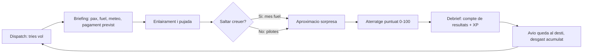

# Pont Aeri — Document de disseny (Nivell 1)

> **Nota per als agents.** Aquest fitxer és l'exportació del document de
> disseny (Claude Doc, revisió 57, 26/09/2026). Descriu el *què* i el *per
> què* del mode Airline. `ENGINEERING.md` descriu el *com* i mana sobre el codi.
>
> **Regla de prioritat:** per a qualsevol valor numèric, mana
> `src/career/balance.js` (tasca B1, congelat). Si aquest document i
> `balance.js` no coincideixen, fes servir `balance.js` i no ho consideris una
> incoherència que bloquegi la tasca. Divergències ja conegudes:
>
> - **Tarifa de tripulació** (secció *Els costos*): aquí surten tres tarifes
>   (450 / 900 / 1.800 €/h); `balance.js` en té quatre, amb `commuter` a part.
> - **XP per vol** (secció *Rangs*): el text diu "de −15 a +50"; el rang real
>   és el de la taula d'aterratge i de `BALANCE.landingBands`.
> - **Accidents** (secció *Danys, reparacions i assegurança*): la taula diu
>   "15–40 %" i "−300 a −800 XP"; manen `BALANCE.crash` (15–60 % del valor,
>   14–45 dies a terra, 200–1.500 XP). L'avió no es perd mai: la pèrdua total
>   és al `BACKLOG.md`.
>
> Valors que aquest document esmenta però no fixa (hores punta, dificultat
> d'aeroport, tarifa dels vols de contracte, seients per avió) s'afegeixen a
> `balance.js` a la tasca B2. El preu de referència i la demanda base **no**
> van en una taula per ruta, com suggereix el text: es calculen a partir de
> la distància i de la mida dels dos aeroports, amb una taula d'excepcions
> per a rutes especials.
>
> Les decisions de disseny estan tancades (secció *Decisions*). No les
> reobris sense que ho demani en Marc.

---

Proposta: dos modes al menú (Free Flight i Airline), una economia en euros amb costos operatius reals i un únic factor de balanç global, i dues vies de progressió paral·leles — el pilot (XP, rangs, habilitacions) i la companyia (flota, rutes, diners).

## Modes de joc i menú principal

El menú d'entrada ofereix dues portes: **Free Flight** (el que ja existeix, amb totes les opcions obertes) i **Airline** (la partida amb progrés). *Airline* és millor nom que *History Mode*, perquè en anglès "story mode" implica una narrativa guionitzada, que no és el cas.

Això obliga, però, a rebatejar una cosa: el document del Nivell 0 feia servir "mode Aerolínia" per referir-se a volar amb avió d'altri, i ara el nom xocaria amb el del mode principal. A partir d'aquí, dins d'Airline hi ha **vols de contracte** (avió d'altri, tarifa fixa) i **vols propis** (el teu avió, tu poses el preu).

Les dues portes comparteixen el simulador sencer. La diferència és que a Airline l'avió, el combustible, la meteorologia i la ruta els decideix l'estat de la partida, no uns desplegables.

### Concepte visual del menú

No cal un hangar. La proposta és aprofitar el motor que ja teniu: el menú **és** una càmera del joc aparcada al vostre avió actual, a l'stand de la vostra base, a l'hora daurada, amb òrbita lenta i so ambient. El codi ja sap posar qualsevol avió a qualsevol gate a qualsevol hora del dia, així que el cost és gairebé zero i el resultat no s'assembla a cap altre joc.

A sobre, la interfície té estètica de **taulell de sortides d'aeroport**: fons pissarra, tipografia condensada, files fines, accents ambre i verd, i separadors que recorden els panells de vol. Aquesta mateixa estètica es reutilitza a la pantalla de tria de vol, que ja estava plantejada com un taulell de sortides.

### Barra superior permanent (només a Airline)

| Element | Contingut | Per què hi és |
| --- | --- | --- |
| Pilot | Nom + distintiu de rang | Identitat i progrés visible |
| XP | Barra fins al rang següent | Objectiu a curt termini sempre a la vista |
| Diners | Saldo en € + variació de l'últim vol | Feedback econòmic immediat |
| Reputació | 0–100, amb fletxa de tendència | Multiplica la demanda; dona pes als errors |
| Flota | Avions operatius / totals | Estat de la companyia d'un cop d'ull |
| Base | ICAO de la base actual | Recorda on ets i on són els avions |
| Data i hora | Rellotge intern de la partida | Fa viu el món sense costos passius |
| Avís | Xip amb el següent esdeveniment | Manteniment vençut, check-ride disponible, ruta en risc |

### Pestanyes del centre d'operacions

1. **Dispatch** — taulell de sortides: rutes i contractes disponibles des d'on ets.
2. **Fleet** — els teus avions, estat, hores, cicles i on són ara mateix.
3. **Market** — compra, lloguer i venda d'avions de segona mà.
4. **Crew** — contractació de tripulacions, que és el que multiplica els trams per dia.
5. **Pilot** — llibre de vol, XP, rangs, habilitacions i rècords.
6. **Finance** — compte de resultats, préstecs i històric.
7. **Map** — mapa del territori amb aeroports, rutes obertes i posició de la flota.

Un detall que val la pena: el **llibre de vol** (logbook) hauria de guardar cada vol amb data, ruta, avió, temps de bloc, nota d'aterratge i resultat econòmic. És barat de fer, dona sensació de carrera acumulada i és exactament el que un pilot real conserva.

## El bucle de joc

Un cicle complet dura entre 12 i 25 minuts reals: triar vol, carregar, volar, aterrar, cobrar. Tot el disseny econòmic està calibrat sobre aquesta durada.



Tres punts que fan que el cicle enganxi:

- **L'avió es queda on aterra.** Si vols tornar a la base, o hi voles, o pagues un vol de posicionament buit. Això genera logística real sense cap art addicional.
- **Les condicions de l'aproximació són una sorpresa** un cop saltat el creuer, tal com ja estava decidit. La meteo dolenta paga més, però no la tries.
- **El debrief barreja les dues monedes del joc**: euros (companyia) i XP (pilot). Cada vol alimenta les dues barres de la capçalera.

### Temps, acceleració i salt de creuer

**Sostre dur: 30 minuts reals per vol.** Cap ruta del joc no pot exigir més temps assegut que això, i tot el balanç econòmic hi està calibrat. Amb la xarxa dels Països Catalans això no costa gens; a partir de l'escala peninsular i sobretot al llarg radi, cal donar eines.

N'hi ha dues, i són deliberadament diferents:

| Eina | Què fa | Què costa |
| --- | --- | --- |
| Acceleració ×2 i ×4 | Disponible a partir de 1.000 ft AGL | Res |
| Acceleració ×16 i ×32 | Només amb creuer estable | Res |
| Salt de creuer | Et deixa a 10 nm en final | +8 % de combustible |

**L'indicador de creuer estable** és el que demanaves. S'encén al HUD quan es compleixen quatre condicions alhora durant 30 segons: altitud mantinguda dins de ±200 ft, pilot automàtic connectat, velocitat estable i cap canvi de configuració. Llavors apareix *CRUISE STABLE — time ×16 available* i s'obren les acceleracions grans.

Es tanca sol quan toca: qualsevol entrada als comandaments, una desviació d'altitud o arribar al punt d'inici de descens tornen a ×1 amb un avís d'un parell de segons d'antelació. Això evita el cas lleig de despertar-se accelerat a 30 nm de la pista.

La diferència de fons entre les dues eines és on et deixen. **Accelerar et manté a la cabina**, així que no costa res. **Saltar el creuer te'n treu**, així que paga el 8 % de combustible extra i, sobretot, et fa descobrir les condicions de l'aproximació de cop, sense temps de preparar-te. Qui vulgui la nota alta pilotarà el descens.

## Escola de vol: la fase zero

Abans de tenir companyia, el jugador té instructor. L'escola de vol és el primer que es troba en obrir Airline per primer cop, i queda sempre accessible des del menú per repetir qualsevol lliçó. Totes les pràctiques es fan amb el **Migjorn Mi-9**, l'avió més senzill de la flota.

Cada lliçó és un vol curt, amb meteorologia calma, sense economia i sense conseqüències. L'instructor parla per ràdio amb text a pantalla i, si voleu, veu gravada; no hi ha cap personatge modelat, només la seva veu i el seu nom al taulell.

| # | Lliçó | Què s'hi aprèn | Criteri per passar |
| --- | --- | --- | --- |
| 1 | L'avió per fora | Càmeres, òrbita, parts de l'aparell, panells | Visitar les 4 vistes |
| 2 | La cabina | Instruments, HUD, flaps, tren, frens, invertida | Identificar 6 comandaments |
| 3 | Rodatge | Frè d'aparcament, direcció de morro, sortir del gate | Arribar al llindar de pista |
| 4 | Enlairament | Potència, VR, rotació, pujada inicial, tren amunt | Pujar net fins a 3.000 ft |
| 5 | Maniobres | Virar coordinat, nivellar, velocitats, entrada en pèrdua | Mantenir altitud ±200 ft |
| 6 | El circuit | Tram de vent en cua, base, final visual | Arribar a final estabilitzat |
| 7 | L'aterratge | Senda, Vref, arrodoniment, contacte, frenada | Nota ≥ 45 |
| 8 | Aproximació ILS | Localitzador, senda electrònica, mínims | Aterrar dins de pista |

La lliçó 7 és la que sosté tota la resta del joc, i per això porta dues ajudes que no hi ha enlloc més. La primera és **feedback en directe durant l'arrodoniment**: una barra que mostra la sink rate real contra la desitjada mentre baixes els últims 50 peus, de manera que el jugador veu la relació entre el que fa amb el morro i el que marca el variòmetre. La segona és que **l'informe detallat s'obre sol** després de cada intent, amb els cinc components desglossats, en comptes d'haver-lo de demanar.

Totes dues desapareixen en sortir de l'escola. La barra d'arrodoniment es pot tornar a activar des de la pràctica lliure, però no als vols que donen diners.

### La graduació

Proposo **nota ≥ 45** a la lliçó 7, no 30. El motiu és econòmic: amb la taula endurida, un aterratge de 45 punts amb prou feines cobreix els costos, i per sota de 30 hi entren les factures de manteniment. Graduar-se amb 30 ensenyaria exactament el que el joc castigarà després.

Perquè ningú no es quedi encallat, a partir del **tercer intent fallit** l'instructor et deixa passar amb 30 i t'ho diu clarament: aprovat provisional, torna a l'escola quan vulguis. El jugador avança i sap que li falta ofici.

En graduar-se rep: **habilitació commuter**, **250 XP**, el capital inicial de 400 k€ i el primer accés al mercat d'avions. És el moment en què s'obre el centre d'operacions.

### Trucs i pràctica lliure

A banda de les lliçons, l'escola té un apartat de **pràctica lliure**: tria avió, aeroport, meteorologia i posició inicial, i aterra tants cops com vulguis amb la puntuació completa però sense diners ni XP. És el lloc natural per posar els consells que no caben en una lliçó: com llegir la sink rate, quan treure els spoilers, com corregir un aterratge llarg, què fer amb vent creuat.

## Escala econòmica: el problema i la solució

**El problema.** Amb xifres reals, un vol Barcelona–Palma amb un A320 factura uns 9.700 € i costa uns 4.000 €. Un A320 de segona mà en val 8 milions. Són 1.400 vols per pagar-lo. Cap jugador no farà 1.400 vols.

El marge d'una aerolínia real és del 3–5 %, i un avió real fa 2.000 vols l'any. El jugador en farà 150 en tota la partida. La compressió és inevitable: la qüestió és **on** la posem.

**La solució recomanada.** Tres palanques, cap d'elles visible com a "truc":

1. **Tarifes de referència premium.** El P\_ref de cada ruta es fixa a taula, no al preu real de mercat. Un Barcelona–Palma val 210 € en comptes de 60 €. Segueix sent una xifra creïble (una tarifa business real ho és) i multiplica el marge per 3,5.
2. **Factor de rotació.** Cada vol que pilotes tanca el **dia d'operació** d'aquell avió: tu voles el tram estrella i la tripulació en vola la resta. El factor va d'1,0 (vols sol) fins a 2,6–2,7 segons la classe (1,8 als widebody, que fan menys trams per dia), i és el que compres a la pestanya Crew. Aquesta és la palanca de progrés *dins* d'una mateixa classe d'avió.
3. **Factor global K.** Un únic número a `balance.js` que multiplica el resultat net final. Tota la corba de ritme es retoca canviant-lo. Valor de sortida proposat: **K = 2,6**.

**Els costos es queden reals.** El combustible surt del consum que ja simula el model de vol, a 0,90 €/kg. Les taxes, el handling i la tripulació també. Això vol dir que volar bé (perfil eficient, no cremar querosè a TOGA) es nota de veritat al compte de resultats.

### Corba objectiu

| Classe | Seients | Net per vol, sol | Net per vol, tripulació completa | Preu d'ocasió | Vols per saltar a la classe següent |
| --- | --- | --- | --- | --- | --- |
| Migjorn Mi-9 (commuter) | 19 | 8.500 € | 22.000 € | 350 k€ | 24 |
| Garbí G-72 (turbohèlix) | 70 | 28.000 € | 75.000 € | 1,8 M€ | 32 |
| Mestral M-200 (narrowbody) | 180 | 80.000 € | 215.000 € | 8 M€ | 30 |
| Llevant L-900 (widebody) | 300 | 230.000 € | 420.000 € | 22 M€ | 32 |
| Tramuntana T-4 (jumbo) | 400 | 350.000 € | 600.000 € | 30 M€ | — |

El salt de classe es fa amb finançament: **30 % d'entrada** i la resta a terminis que es cobren per vol, mai pel pas del temps. Amb aquests números cada classe dura entre 6 i 10 hores de joc, i la partida sencera fins al jumbo ronda les 35 hores.

**Capital inicial: 400 k€** (150 k€ propis + un crèdit de 250 k€). Just per comprar el Migjorn Mi-9 i pagar el primer dipòsit de combustible. El primer avió es compra al minut u, tal com volíeu.

### L'alternativa que descarto

L'altra opció seria mantenir tarifes reals i dividir els preus dels avions per 40. Funciona igual de bé matemàticament, però el primer avió costaria 45.000 € i el jumbo 750.000 €. Es perd la sensació de "milions" que fa que el mercat d'avions sigui aspiracional. Si preferiu aquesta via, només cal canviar dues taules.

## El compte de resultats d'un vol

Una sola fórmula governa tots els ingressos del joc:

```latex
\text{resultat} = K \cdot r \cdot \bigl( P \cdot n_{\text{pax}} \cdot m_{\text{ruta}} \cdot m_{\text{aterratge}} - C \bigr)
```

On `K` és el factor global de balanç, `r` el factor de rotació segons tripulació, `P` el preu del bitllet, `m_ruta` el multiplicador de dificultat i exclusivitat de la ruta, `m_aterratge` el de la nota d'aterratge, i `C` la suma de costos del tram.

### Els costos

| Partida | Com es calcula |
| --- | --- |
| Combustible | kg cremats pel model de vol × 0,90 €/kg |
| Taxes i handling | 12 €/t de MTOW + 1,80 € per passatger, per aeroport |
| Tripulació | hores de bloc × tarifa de classe (450 / 900 / 1.800 €/h) |
| Provisió de manteniment | hores × coeficient del tipus, més cost per cicle |
| Finançament | quota per vol si l'avió està a terminis o llogat |

Que el combustible surti del consum simulat és el detall que lliga el simulador amb l'economia: pujar massa ràpid, anar amb sobrepès de querosè o volar el creuer a 250 kt es paga en euros.

### L'aterratge decideix el marge

El multiplicador d'aterratge s'aplica **als ingressos, no al resultat**, cosa que fa que un aterratge dolent pugui tancar el vol en pèrdues. És el que dona pes real a l'única cosa que el jugador controla del tot.

| Nota | m\_aterratge | XP | Resultat d'un vol M-200 (base 71.500 €) |
| --- | --- | --- | --- |
| 99–100 | 1,35 | +55 | +100.000 € |
| 95–98 | 1,20 | +40 | +88.000 € |
| 90–94 | 1,08 | +30 | +78.000 € |
| 82–89 | 1,00 | +20 | +71.500 € |
| 72–81 | 0,85 | +12 | +59.000 € |
| 60–71 | 0,60 | +4 | +39.000 € |
| 45–59 | 0,35 | 0 | +18.000 € |
| 30–44 | 0,15 | −8 | −10.000 € amb inspecció de tren |
| 15–29 | 0,00 | −20 | −106.000 € amb amortidors nous |
| 0–14 | 0,00 | −35 | −110.000 a −210.000 € |

Aquesta taula endureix la del Punt 2 a les dues puntes. El 100 % de pagament ara demana 82 punts en comptes de 80, els bonus no arrenquen fins a 90, i tot el tram mitjà cobra menys: un aterratge de 70 punts passa del 90 % al 60 %.

El que fa mal de debò, però, no és el multiplicador sinó **la factura de reparacions**. Amb el M-200 valorat en 8 M€, un contacte per sota dels 30 punts vol dir gairebé segur uns amortidors nous, i això són 96.000 € que es mengen el vol sencer i part del següent. És exactament l'efecte que buscàvem: un aterratge dolent no és cobrar menys, és perdre diners.

Els missatges de cada tram es conserven tal com estaven redactats, reassignats als nous llindars.

### Bonus addicionals

- **Puntualitat**: +4 % dels ingressos, i només dins d'una finestra de ±10 minuts sobre l'hora prevista. Arribar tard no resta, però arribar molt tard cancel·la el contracte.
- **Eficiència**: es cobra el 35 % del combustible estalviat respecte del pla de vol, i només a partir d'un 3 % d'estalvi. Els estalvis petits són soroll, no mèrit.
- **Confort de cabina**: mètrica nova a partir de la g màxima, l'alabeig màxim i els canvis bruscos d'actitud durant tot el vol. No dona diners, mou la reputació.
- **Cap plus no s'aplica si l'aterratge baixa de 82.** Un vol no es pot salvar amb bonus si el final ha estat dolent, i això evita que el jugador optimitzi el creuer i s'oblidi del que importa.
- **Vol nocturn o meteorologia dura**: entra per `m_ruta`, no per un bonus a part.

### Danys, reparacions i assegurança

Tot cop mal donat costa diners, i el cost es calcula sempre com a percentatge del **valor actual de l'avió**, de manera que fer el burro amb un jumbo és molt més car que amb un commuter.

| Fet | Cost | Efecte afegit |
| --- | --- | --- |
| Contacte > 600 fpm o > 2,2 g | 0,15 % del valor | Inspecció de tren, avió aturat 1 dia |
| Contacte > 800 fpm o > 2,6 g | 1,2 % | Substitució d'amortidors, 3 dies |
| Tailstrike | 2,5 % | Revisió estructural, 5 dies |
| Contacte fora de pista | +0,5 % | Danys de tren i motors per FOD |
| Sortida de pista al frenat | 3 % | 7 dies |
| Accident recuperable | 15–40 % | 2–4 setmanes, −300 a −800 XP |
| Accident greu | fins al 60 % | Fins a 6 setmanes a terra; l'avió no es perd mai (BACKLOG.md) |

Això obre una decisió recurrent que m'agrada per al mid game: l'**assegurança de cèl·lula**. Es paga com a prima per vol (al voltant del 0,12 % del valor) i cobreix el que passi de la franquícia, que el jugador tria entre el 5 % i el 25 % del valor. Franquícia alta vol dir prima barata i molt de risc. És un embornal de diners que, a diferència del manteniment, el jugador pot decidir no pagar.

Als vols de contracte no hi ha res d'això: l'avió no és teu i els danys no te'ls cobren. El preu és que la pèrdua d'XP i de reputació són iguals o pitjors.

### Els vols de contracte com a xarxa de seguretat

Volar amb avió d'altri paga una **tarifa fixa per tram** en comptes d'un marge (uns 6.000 € amb turbohèlix, 18.000 € amb narrowbody, multiplicat pel rang de pilot). No enriqueix, però mai deixa el jugador sense sortida si es queda sense diners i amb la flota aturada per manteniment. És la vàlvula de seguretat contra el bloqueig econòmic, que és el risc número u d'aquest tipus de joc.

## Rutes, demanda i contractes

La demanda segueix el model d'elasticitat ja acordat, amb els paràmetres concretats:

```latex
n_{\text{pax}} = \min\Bigl( \text{seients},\; D_{\text{base}} \cdot \left(\tfrac{P_{\text{ref}}}{P}\right)^{e} \cdot f_{\text{hora}} \cdot f_{\text{meteo}} \cdot f_{\text{reputació}} \Bigr)
```

- `e = 1,6` a rutes turístiques (Balears, estiu) i `e = 1,1` a rutes de negocis. Com més alta, més castiga apujar el preu.
- `f_hora`: 1,15 a les puntes del matí i el vespre, 0,7 de matinada.
- `f_meteo`: fins a 0,8 amb temporal.
- `f_reputació = 0,6 + 0,8 × (rep/100)`. Una companyia de reputació 50 ven exactament la demanda base.

Als vols de contracte el preu és fix i el jugador només tria el vol. Als vols propis el fixa ell, i la corba fa que sobrepreu i preu regalat siguin igual de dolents.

### Multiplicador de ruta

`m_ruta = 1 + dificultat_aeroport + bonus_meteo + exclusivitat`

La Seu d'Urgell (pista curta, muntanya, aproximació visual) suma +0,50. Sabadell +0,30. Maó +0,10. El Prat, 0. La meteorologia dura suma entre +0,15 i +0,60, i les rutes que cap competidor no serveix, +0,25. Això és el que dona valor a l'"exclusivitat" d'una ruta sense inventar cap sistema nou.

### Meteorologia

Procedimental i amb llavor, no dades reals. Cada vol té les seves condicions, generades a partir de la ruta, la data interna i l'hora, de manera que són diferents cada cop però reproduïbles si cal depurar un cas concret.

El contrast és moderat: la majoria de vols tenen vent fluix i visibilitat bona, i les condicions dures apareixen prou sovint per trencar la rutina sense fer-se pesades. Recomano una distribució on un vol de cada cinc tingui vent apreciable i un de cada quinze, condicions realment complicades.

El detall que val la pena és fer que els patrons siguin **locals i estacionals**: boira matinal a Lleida i Girona a l'hivern, marinada de tarda al Prat, tramuntana a l'Empordà, turbulència tèrmica d'estiu a la Seu. Surt gairebé gratis i fa que els noms de la flota tinguin sentit: el jugador acaba sabent què vol dir que bufi garbí.

### Tipus de contracte

La varietat de contractes és el que evita que el joc sigui sempre el mateix vol. Tots reutilitzen el mateix motor:

| Contracte | Què el fa diferent | Per a qui |
| --- | --- | --- |
| Línia regular | Pax, demanda elàstica, horari fix | El pa de cada dia |
| Xàrter | Pagament fix alt, exigència de confort i puntualitat | Avions mitjans |
| Càrrega | Sense confort, molt pes, consum alt | Variants freighter |
| Posicionament | Buit, paga poc, mou l'avió on el vols | Logística |
| Evacuació mèdica | Nocturn, meteo dolenta, límit de temps, paga molt | Pilots amb habilitacions |
| Wet lease | Voles l'avió d'una altra companyia amb la seva lliurea | Accedir a classes que encara no pots comprar |

### Aeroports per fases

| Fase | Aeroports | Què aporta |
| --- | --- | --- |
| Ja fet | LEBL, LEPA | Base del bucle actual |
| 1 | LEGE Girona, LERS Reus, LEIB Eivissa, LEMH Maó | Xarxa curta, avions petits, rutes turístiques |
| 2 | LELL Sabadell, LEDA Lleida, LESU la Seu | Pistes curtes i muntanya: primer contingut de dificultat |
| 3 | LEVC València, LEAL Alacant, LECH Castelló, LFMP Perpinyà | Tanca els Països Catalans |
| 4 | LEMD, LEZL, LEMG, LFMN, LIRF, LFPO | Escala peninsular i mediterrània, entra el narrowbody |
| 5 | EGLL, EDDF, KJFK, GCLP, SBGR | Llarg radi, widebody i jumbo |

Les fases 1 a 3 surten del pipeline d'OurAirports amb pistes reals. Per a taxiways i gates recomano **generació procedimental** a tot arreu menys LEBL i LEPA: la diferència visual és petita des de la cabina i el cost de fer-ne vint a mà és enorme.

## Progressió del pilot

Hi ha **dues vies de progrés paral·leles** i cap de les dues no substitueix l'altra. Els diners fan créixer la companyia; l'XP fa créixer el pilot i obre portes que els diners sols no obren. Un jugador ric però sense habilitació de tipus no pot volar el seu propi avió.

### Rangs

| Rang | XP | Multiplicador en contracte | Què obre |
| --- | --- | --- | --- |
| Alumne pilot | 0 | ×1,0 | Commuter, aeroports fàcils, només de dia |
| Pilot privat | 500 | ×1,25 | Habilitació nocturna, turbohèlix |
| Pilot comercial | 2.000 | ×1,55 | Narrowbody, pistes curtes, baixa visibilitat |
| Pilot de línia | 6.000 | ×1,85 | Widebody, llarg radi, segona base |
| Comandant | 15.000 | ×2,20 | Jumbo, contractar comandants per a la flota |
| Instructor | 35.000 | ×2,50 | Formar tripulacions pròpies (surt més barat) |

L'XP per vol surt de la taula d'aterratge (de −15 a +50), multiplicat per turbulència (×1,3), meteorologia dura i dificultat de l'aeroport. Un vol mitjà d'early game dona uns 25 XP; un de mid game amb condicions dolentes, uns 70.

### Habilitacions de tipus

Substitueixen les "llicències" genèriques per una cosa que existeix de veritat a l'aviació, i eviten assemblar-se a cap altre joc. Cadascuna demana rang, diners i un **check-ride**: un vol guionitzat amb criteris de pas.

| Habilitació | Rang mínim | Cost | Criteri del check-ride |
| --- | --- | --- | --- |
| Commuter | — | inclosa | Vol de qualificació inicial (tutorial) |
| Turbohèlix | Privat | 25 k€ | Aterratge ≥ 70 amb vent creuat de 12 kt |
| Narrowbody | Comercial | 120 k€ | ILS complet + motor a l'alenti a l'aproximació |
| Widebody | De línia | 400 k€ | Vol llarg dins del pressupost de combustible |
| Quadrimotor | Comandant | 600 k€ | Aterratge ≥ 80 a MLW |

### Endorsements

Són el segon gran embornal de diners i el que desbloqueja contingut de dificultat:

- **Vol nocturn** — 15 k€, rang Privat. Obre la meitat de les franges horàries.
- **Vent creuat fort (>25 kt)** — 30 k€. Sense això, els vols amb vent fort no apareixen al taulell.
- **Baixa visibilitat CAT II/III** — 60 k€, rang Comercial. Boira, i amb ella els contractes millor pagats de tardor i hivern.
- **Pista curta i muntanya** — 45 k€, rang Comercial. La Seu d'Urgell i Sabadell.
- **Llarg radi i oceànic** — 150 k€, rang de Línia. Tot el que surti de la Península.

### Accidents

Un crash real fa perdre XP proporcional a la gravetat (de 200 a 1.500 XP) i pot fer baixar de rang. Recomano que **la baixada sigui proporcional, no d'un graó sencer**: perdre el rang de cop després de vint hores de joc és el tipus de càstig que fa tancar el joc i no tornar-hi. Als vols propis, a més, es paga la reparació i l'avió queda setmanes a terra, però no es perd mai; als de contracte, només l'XP i la reputació.

## Flota, mercat d'ocasió i manteniment

### Ampliar la flota sense multiplicar la feina

Un mercat amb quatre avions no és un mercat. La manera barata d'arribar a quinze models és fer **variants** dels quatre que ja teniu: mateixa aerodinàmica base, geometria escalada, masses, empenta i seients retocats. Cada variant són poques hores de feina i un test al harness que ja existeix.

Els noms segueixen la sèrie de vents, que és una de les coses més ben trobades del projecte:

| Model | Classe | Seients | Estat |
| --- | --- | --- | --- |
| Migjorn Mi-9 | Commuter bimotor | 19 | **Nou** — avió d'entrada, clau per al ritme inicial |
| Garbí G-42 | Turbohèlix curt | 48 | Variant del G-72 |
| Garbí G-72 | Turbohèlix | 70 | Ja existeix |
| Garbí G-72F | Càrrega | — | Variant |
| Xaloc X-90 | Jet regional | 100 | **Nou** — omple el buit entre turbohèlix i narrowbody |
| Mestral M-100 | Narrowbody curt | 140 | Variant |
| Mestral M-200 | Narrowbody | 180 | Ja existeix |
| Mestral M-300 | Narrowbody allargat | 220 | Variant |
| Llevant L-900 | Widebody | 300 | Ja existeix |
| Llevant L-900ER | Widebody llarg radi | 290 | Variant |
| Tramuntana T-4 | Jumbo | 400 | Ja existeix |
| Tramuntana T-4F | Jumbo de càrrega | — | Variant |

El Migjorn Mi-9 és el que fa que el primer avió sigui assequible. Si només hi hagués el G-72, o el capital inicial hauria de ser de 2 milions, o el primer salt seria eternament llarg.

### Què costa realment fer els dos models nous

Menys del que sembla, perquè cap dels dos no necessita física nova. El model de vol ja està escrit de manera genèrica: agafa coeficients aerodinàmics, masses, inèrcies, taules de flaps i dades de motor, i el harness sense interfície ja valida que els resultats caiguin dins de rangs realistes.

| Peça | Migjorn Mi-9 | Xaloc X-90 |
| --- | --- | --- |
| Base de derivades | Escalat del Garbí G-72 | Interpolació entre G-72 i Mestral M-200 |
| Motorització | 2 turbohèlixs de 1.200 kW | 2 turbofans de 65 kN |
| Geometria 3D | Fuselatge curt, ala alta | Fuselatge estret, motors a cua |
| Cabina | Reutilitza la de turbohèlix | Reutilitza la de jet |
| Validació | Rangs nous al harness | Rangs nous al harness |

La feina real són les derivades d'estabilitat i la calibració de CLmax, i això és exactament el que el harness detecta si queda malament. Calculo mig dia de feina per model, més les variants, que són retocs de massa, seients i longitud sobre una base ja validada.

### Mercat d'ocasió

La botiga no ven "models", ven **avions concrets amb historial**, com un anunci real de compravenda. Cada entrada té any de fabricació, hores totals, cicles, estat per sistema, manteniment pendent i preu. Un G-72 del 1998 amb 40.000 hores i el motor a punt de revisió val la meitat que un del 2012, i ho val per un motiu que el jugador entén.

Això converteix la botiga en una decisió de veritat (barat i arriscat vs car i fiable) en comptes d'una llista de preus. El llistat es regenera cada cert nombre de vols, amb 6–10 anuncis actius.

El **lloguer** és l'altra via: sense entrada, una quota per vol i el manteniment pesat a càrrec del propietari. Serveix per provar una classe abans de comprar-la i per cobrir una punta de demanda.

### Manteniment

Cada cèl·lula porta quatre indicadors d'estat de 0 a 100: **motors, tren, cèl·lula i aviònica**.

| Sistema | Es desgasta amb | Es nota quan falla |
| --- | --- | --- |
| Motors | Hores, i molt més amb TOGA prolongat | Pèrdua d'empenta, apagada en vol |
| Tren | Severitat de cada aterratge (fpm i g) | Tren que no baixa o no bloqueja |
| Cèl·lula | Cicles | Més resistència, penalització de consum |
| Aviònica | Hores | ILS o pilot automàtic fora de servei |

Probabilitat d'avaria per vol quan un sistema baixa de 70: creix de manera quadràtica, del 0,2 % fins a més del 8 % a estat 20. Les avaries no són un càstig sinó contingut: un vol amb un motor apagat i l'ILS fora de servei és el millor vol de la partida, i hauria de pagar-se com a tal.

Revisions: **línia** (automàtica, barata, després de cada vol), **A-check** cada 500 h (≈0,8 % del valor), **C-check** cada 6.000 h (≈4 % i l'avió queda immobilitzat uns quants dies de joc), i **revisió de motors** al seu propi cicle. Ajornar una revisió és possible i és exactament el tipus de decisió arriscada que fa interessant el mid game.

## Vols automàtics (despatx)

És la peça que fa que tenir sis avions tingui sentit sense haver-los de volar tots. El jugador tria avió, ruta i tripulació, i el vol es fa sol.

### Com es resol, tècnicament

Aquesta és la part que et preocupava, i té una resposta neta: **un vol despatxat no es simula i no corre en temps real**. Es guarda com una entrada a una cua dins de la partida i es resol de cop en el moment en què el rellotge intern avança, és a dir, **quan tu acabes el vol següent**.

1. Despatxes un o més vols des de la pestanya Fleet. Cada entrada guarda avió, ruta, tripulació i hora de sortida prevista.
2. Voles tu el teu vol, que consumeix, posem, 2 h 40 min de rellotge intern.
3. En aterrar, el joc resol totes les entrades de la cua que caiguessin dins d'aquestes 2 h 40 min, i et mostra una targeta de resum: *"Mentre volaves: 3 vols despatxats, +142.000 €, un retard a Eivissa."*

Això evita els tres problemes clàssics dels ingressos passius: no calen temporitzadors en segon pla, no es guanyen diners amb el joc tancat (coherent amb la decisió de no tenir despeses passives) i el resultat és **determinista i desable**, perquè només depèn de la llavor guardada i de les dades de l'avió i la tripulació.

### Com es calcula el resultat

La mateixa fórmula del compte de resultats, amb tres diferències:

- La nota d'aterratge no la poses tu: es treu d'una distribució centrada en l'**habilitat de la tripulació** (una tripulació novella ronda els 60 punts, una veterana els 85), amb una desviació que fa que de tant en tant surti malament de debò.
- El resultat es multiplica per un **percentatge que depèn del rang**, i comença molt baix: un 20 %. És la palanca de progrés d'aquest sistema.
- **Les pèrdues, en canvi, es paguen senceres.** El percentatge només retalla els resultats positius. Un vol despatxat que acabi en un aterratge de 30 punts et costa exactament el mateix que si l'haguessis volat tu.
- **No dona XP**, ni al pilot ni cap al rang.

Els costos, en canvi, són els complets: combustible, taxes, tripulació i desgast. Un avió en mal estat despatxat a una ruta llarga pot perdre diners, i si li peta un motor amb una tripulació dolenta, el resultat és un accident de veritat amb la seva factura.

### Límits perquè no trenqui el joc

| Rang | Slots simultanis | % del resultat |
| --- | --- | --- |
| Alumne pilot | — | Despatx bloquejat |
| Pilot privat | 2 | 20 % |
| Pilot comercial | 3 | 30 % |
| Pilot de línia | 5 | 40 % |
| Comandant | 7 | 50 % |
| Instructor | 9 | 60 % |

Amb dos slots al 20 % i tripulacions dolentes, despatxar afegeix potser un 25 % d'ingressos respecte de volar sol. És un tastet, no una drecera. Al final de la partida, amb nou slots al 60 % i tripulacions veteranes, sí que és una companyia que funciona sense tu, que és exactament la fantasia de l'endgame.

El fre de debò, però, no és cap d'aquestes xifres: és que **els vols despatxats no donen XP**. Pujar de rang, que és l'única manera d'aconseguir més slots i millor percentatge, només passa als comandaments. Qui ho automatitzi tot es queda congelat al 20 % per sempre. El sistema es limita sol, sense cap regla artificial.

A sobre hi ha quatre condicions més:

- **Cada slot ocupat necessita tripulació contractada**, amb el seu sou per vol. Tenir nou slots costa diners encara que no els facis servir.
- **L'avió ha de ser lliure i ser on comença la ruta.** Ni el que voles tu ni cap que estigui en manteniment.
- **Només rutes que ja hagis volat tu almenys un cop.** Primer obres la ruta en persona, després l'automatitzes.
- **Només condicions per a les quals la tripulació estigui qualificada.** Un nocturn amb boira demana una tripulació amb les habilitacions pagades, i pagar-les val diners.

I encara hi ha un límit natural que no cal ni programar: la cua només es resol pel temps de rellotge que consumeix el teu vol. Un salt de 25 minuts a Girona amb prou feines liquida un vol despatxat; un llarg radi a Nova York te'n liquida cinc. Volar llarg és el que fa rendir la flota.

## Arc de la partida

| Acte | Hores de joc | Saldo típic | Flota | Què fa avançar el jugador |
| --- | --- | --- | --- | --- |
| 0 · Escola de vol | 0–1 | — | Mi-9 d'instrucció | Vuit lliçons i la graduació amb nota ≥ 45 |
| 1 · Primers vols | 1–3 | 0,4 → 0,6 M€ | 1 Migjorn Mi-9 | Aprendre el bucle, obrir Girona i Reus |
| 2 · La primera ruta | 3–11 | 0,6 → 2,5 M€ | 1–2 turbohèlixs | Tripulació, habilitació nocturna, primer C-check |
| 3 · Mid game | 11–26 | 2,5 → 15 M€ | 3–6 avions, 2 bases | Narrowbody, baixa visibilitat, vols automàtics, competidors |
| 4 · Endgame | 26+ | 15 M€+ | Widebody i jumbo | Llarg radi, automatitzar la companyia |

### Acte 1 — primers vols

En sortir de l'escola de vol es comença amb 400 k€, el Migjorn Mi-9 i l'habilitació commuter. Només hi ha vols de dia, entre LEBL, LEPA, LEGE i LERS. El primer objectiu real és contractar la primera tripulació, que multiplica els ingressos per 1,5 de cop. És el moment on el jugador descobreix que hi ha una segona capa de decisions sobre el simulador.

### Acte 2 — la primera ruta pròpia

Entra el turbohèlix, i amb ell les Balears i les pistes curtes. Aquí apareixen les tres pressions que sostenen la resta del joc:

1. **On és l'avió.** Amb un sol aparell, cada vol determina d'on pots sortir el següent.
2. **El manteniment venç.** El primer C-check immobilitza l'avió i obliga a volar de contracte una temporada.
3. **La reputació es nota.** Una ratxa d'aterratges de 50 punts fa baixar l'ocupació de manera visible.

### Acte 3 — mid game

És on el joc ha d'estar més ben resolt, perquè és on es queda la majoria de gent. Els sistemes nous són tres:

- **Segona base.** Obrir base a Palma o València costa diners i permet rotacions que abans eren impossibles. Cada base té capacitat limitada d'avions.
- **Companyies competidores.** Aparcades de moment. La idea era que aerolínies fictícies licitessin per les vostres rutes i que perdéssiu l'slot si no les serviu, però el mid game ja té prou sistemes sense això.
- **Vols automàtics.** El despatx s'obre al rang de pilot privat, però fins al de comercial no comença a compensar de debò. És el que permet tenir sis avions sense haver de volar-los tots.

La tensió del mid game és sempre la mateixa i està ben calibrada: **cada euro pot anar a un avió nou, a una habilitació o a tripulació**, i les tres coses fan créixer la companyia per camins diferents.

### Acte 4 — endgame

Widebody, llarg radi i la companyia com a objecte de gestió: contractar comandants amb el seu propi nivell d'habilitat, que volen rutes senceres sense tu amb un rendiment proporcional a la seva qualificació. El jugador passa de pilot a director d'operacions, però sempre pot tornar a agafar els comandaments del vol que vulgui.

## Arquitectura, partida desada i entorns

### Partir el fitxer

Els 4.167 línies actuals ja són al límit del que un sol fitxer aguanta, i la carrera hi afegirà entre 2.000 i 3.000 línies de lògica que no té res a veure amb el vol. Abans de començar recomano partir-lo en mòduls ES amb un build mínim (esbuild, un sol comandament), separant com a mínim `flight/`, `world/`, `render/`, `career/` i `ui/`.

Dues peces mereixen fitxer propi des del primer dia:

- **`balance.js`** — absolutament totes les constants econòmiques en un sol objecte: K, taules de preus, elasticitats, llindars d'XP, costos de manteniment. Rebalancejar no ha de tocar mai la lògica.
- **`career/` sense DOM** — l'estat de la carrera com a funcions pures. Això permet provar-lo sense obrir el navegador.

### Harness econòmic

Ja teniu un harness headless que valida el model de vol contra rangs esperats. El mateix patró aplicat a l'economia val el seu pes en or: un script que simula 200 vols d'un jugador mitjà (nota d'aterratge aleatòria amb una distribució plausible) i imprimeix la corba de diners, el moment de cada compra i el temps fins a cada rang. Ajustar `K` passa de ser intuïció a ser una xifra.

### Partida desada

Clau `pontAeri.career.v1` a localStorage, amb `schemaVersion` i `balanceVersion` dins del JSON. Dues coses que estalvien molts maldecaps:

- **Exportar i importar la partida** com a fitxer JSON. Amb amics provant el joc, poder dir "envia'm la partida" fa que els bugs siguin reproduïbles.
- **Detectar canvis de balanç**: si `balanceVersion` no coincideix, avisar i oferir migració o reinici, en comptes de deixar partides en un estat impossible.

### Idioma

Decidit: **i18n des del primer dia**. En la pràctica vol dir que cap text visible no s'escriu dins del codi, sinó a un fitxer de claus per idioma, i que tot el que es formata (dates, xifres, moneda, unitats) passa per una funció i no per concatenació.

Es comença amb anglès i català, que són els dos que teniu garantits. El cost ara és baix perquè el joc encara té pocs textos; fer-ho quan hi hagi el centre d'operacions sencer, l'escola de vol i tots els missatges d'aterratge costa literalment el triple.

Dues trampes a evitar des del principi: els missatges que es construeixen ajuntant trossos (*"Flaps " + n*) no es poden traduir bé, i les veus de cabina i de l'instructor s'han de tractar com a recursos amb idioma, no com a fitxers solts.

### Producció i proves

Decidit i muntat. **Producció**: GitHub Pages des de `main`, a atlaslabs08.github.io/pont\_aeri/, que és l'enllaç que tenen els amics. **Proves**: Cloudflare Pages des de `dev`, a pont-aeri.pages.dev, i cada branca `feat/*` rep la seva pròpia URL de previsualització.

Com que són dos dominis diferents, `localStorage` ja queda separat sol i no cal cap prefix d'entorn. Els detalls de build i desplegament són a `ENGINEERING.md`.

Es mantenen dues coses: un flag `?dev=1` que obri el panell de depuració, els diners infinits i el salt directe a qualsevol fase, perquè provar el mid game no pot exigir jugar deu hores; i tenir aquest document com a `DESIGN.md` dins del repositori, perquè qualsevol model tingui el context sencer.

## Decisions

Les set decisions estan tancades. Queda el detall numèric fi, que s'ajustarà amb el harness de balanç un cop hi hagi codi.

| Decisió | Resolució |
| --- | --- |
| Escala econòmica | Marges inflats amb preus d'avió reals, tal com està plantejat. K = 2,6 de sortida |
| Punt de partida | Opció A: es compra el primer avió de seguida |
| Durada d'un vol | Sostre de 30 minuts reals, amb indicador de creuer estable i acceleració ×16 i ×32 |
| Duresa de l'aterratge | Confirmada, a condició que l'escola de vol ensenyi bé l'arrodoniment |
| Idioma | i18n des del primer dia, anglès i català |
| Meteorologia | Procedimental amb llavor, contrast moderat, patrons locals i estacionals |
| Competidors | Aparcats fins després de tenir el mid game funcionant |

### El punt de partida: es compra de seguida

El document del Nivell 0 i la idea original arrencaven la partida de maneres diferents. Es queda l'opció A; l'altra es deixa documentada per si mai cal reobrir el debat.

|  | A · Comprar de seguida | B · Pilot contractat primer |
| --- | --- | --- |
| Com comença | Surts de l'escola amb 400 k€ i compres el Mi-9 al minut u | Surts de l'escola sense avió i voles per a companyies, a tarifa fixa |
| Quan tens avió propi | Immediatament | Al cap d'unes 10–15 hores de vols de contracte |
| Què s'activa aviat | Manteniment, danys, assegurança, demanda, preus | Només aterrar i cobrar |
| A favor | La fantasia de tenir companyia arriba de seguida | Rampa suau: aprens a aterrar sense que et costi diners |
| En contra | Molts sistemes alhora per a un jugador novell | L'aerolínia, que és la gràcia del mode, triga massa |

**Decidit: opció A.** El motiu és que l'escola de vol ja fa la feina que justificava la B: vuit lliçons sense economia on aprens a aterrar sense conseqüències. Tenint-la, fer esperar el jugador deu hores més abans de deixar-lo comprar un avió només endarrereix el que fa especial el mode.

Perquè l'A no sigui aclaparadora, els sistemes s'obren de manera esglaonada durant l'Acte 1: el manteniment apareix al cinquè vol, l'assegurança quan compres el segon avió, i el preu lliure del bitllet quan obres la primera ruta pròpia. Fins llavors el joc et posa els valors per defecte i t'explica cadascun quan toca.

### El que no he tocat

Del document de jugabilitat queden fora d'aquest Nivell 1, conscientment: el fantasma de vols passats, el tràfic aeri amb IA, el suport per a comandament, els anuncis de cabina i el minimapa. S'hi afegeixen ara les **companyies competidores**, aparcades per decisió vostra fins que el mid game funcioni.

Cap d'aquestes peces no bloqueja l'economia, i totes guanyen si s'afegeixen sobre una carrera que ja rodi.
